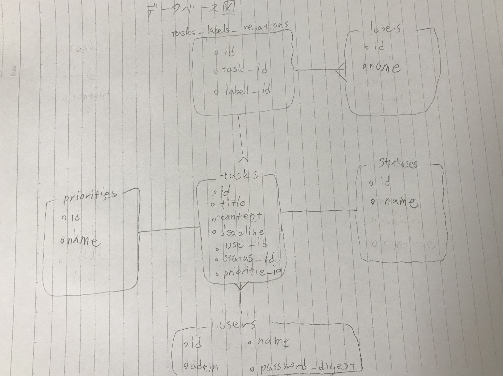
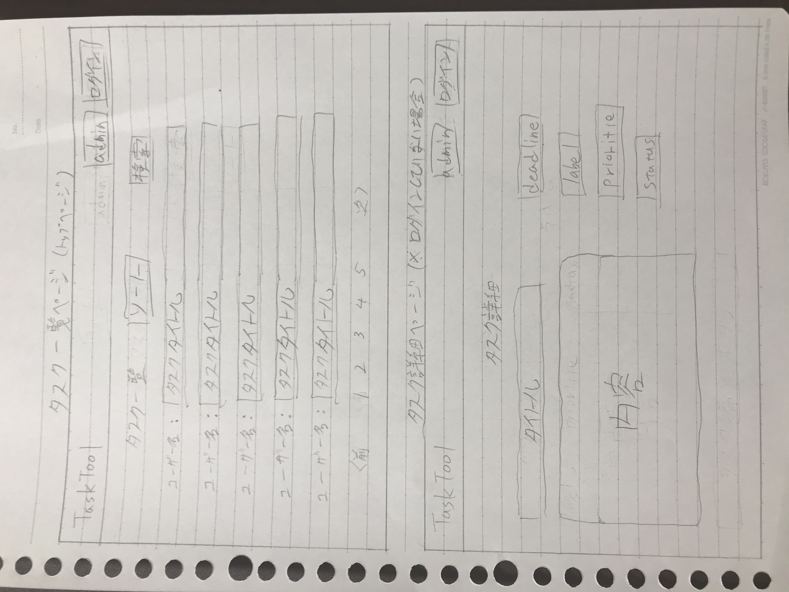
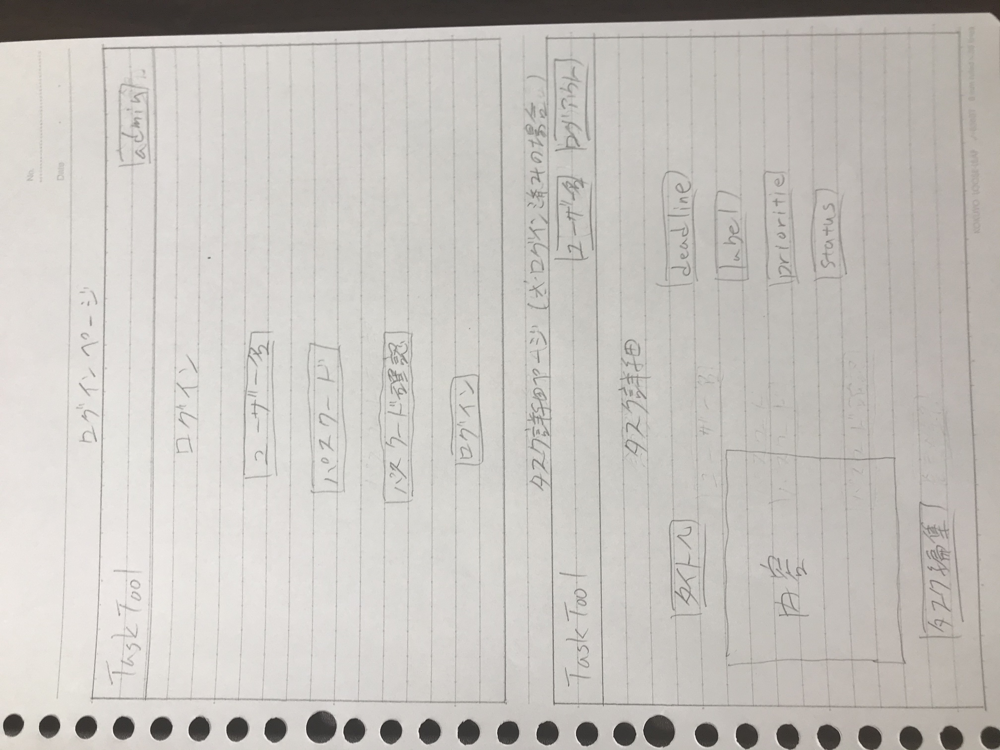
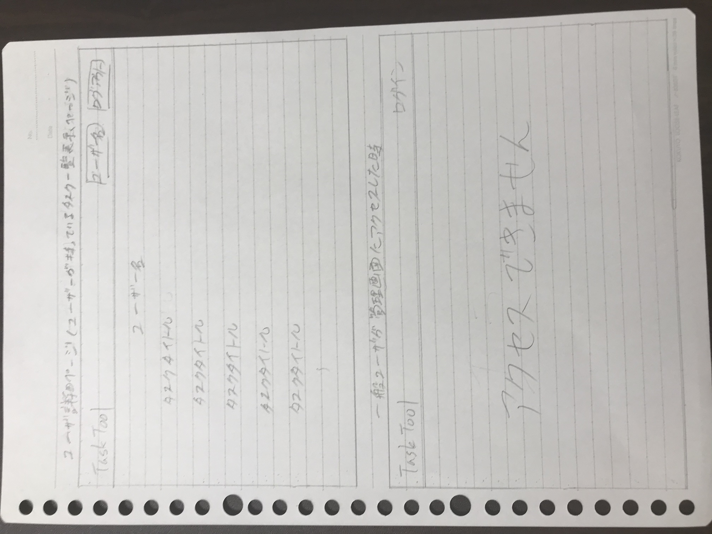
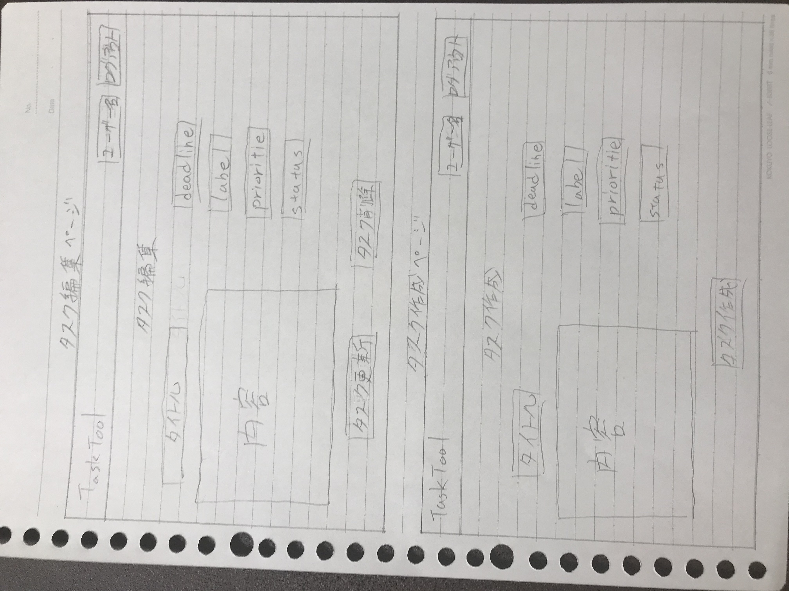
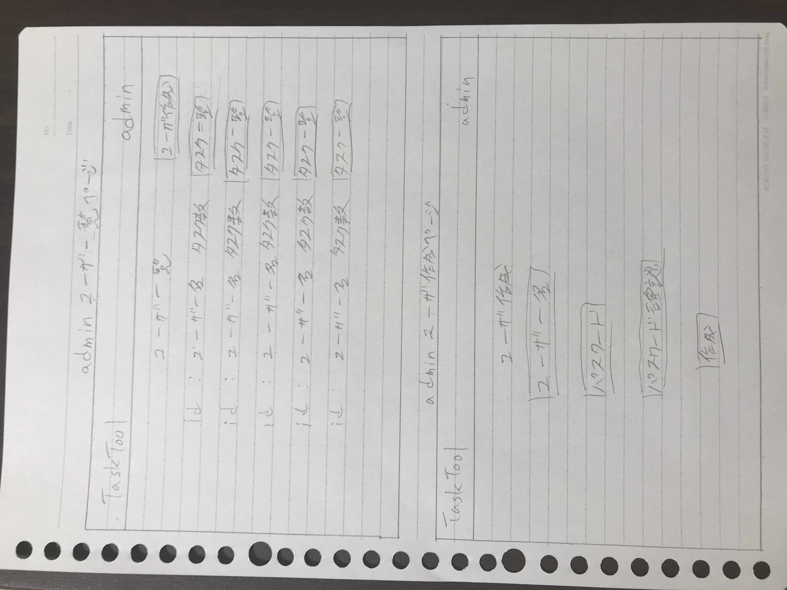
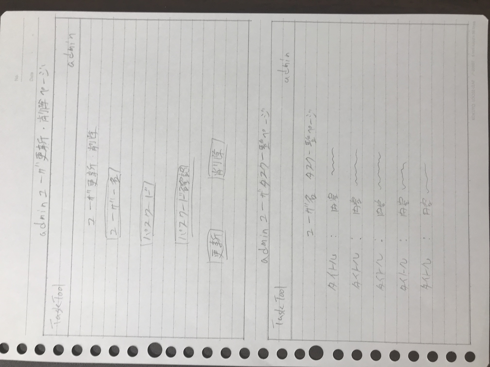

## データベース図  

## 画面設計（予定）  

## テーブルスキーマ  
*(モデル名・カラム名・データ型)*  

(task・title・string)  
(task・content・string)
(task・deadline・date)  
(task・user_id・integer)    
(task・status_id・integer) 
(task・priority_id・integer)   

(user・name・string)  
(user・password_digest・string)  
(user・admin_flag・string)  

(status・name・string)  

(priority・name・string)  

(label・name・string)  

(tasks_labels_relation・task_id・integer)  
(tasks_labels_relation・label_id・integer)  
